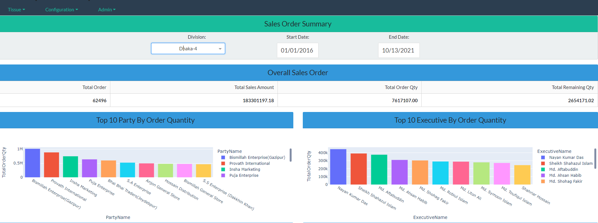

# Dash-data visualization

A web app built in Plotly Dash for Python, which handles user creation, user authentication/login, user permissions (admin/non admin), and page navigation.
This web app is a great data visualization tool for showing data on cloud based dashboard where the top management can be able to make data driven decision. 

Example of app in action with a layout on sales order:

